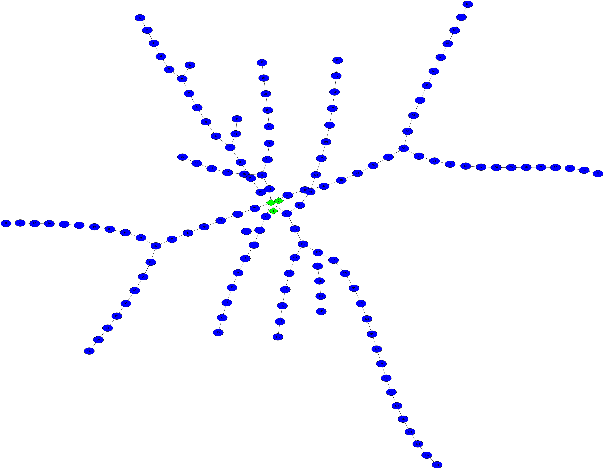

[](https://travis-ci.com/efharkin/swc2dot)

# swc2dot

A simple command line tool for converting neuron morphologies in SWC format to
DOT graph description language.

## Description

Neurons have complex and
[beautiful](https://www.nytimes.com/2018/01/18/arts/design/brain-neuroscience-santiago-ramon-y-cajal-grey-gallery.html)
dendritic arbours that capture synaptic inputs and shape their functional
properties. The SWC file format
[widely](https://alleninstitute.github.io/AllenSDK/cell_types.html#morphology-swc-files)
[used](http://www.neuromorpho.org) to register dendritic morphology is simpler
and [not as
beautiful](http://www.neuronland.org/NLMorphologyConverter/MorphologyFormats/SWC/Spec.html).

The SWC format provides a minimal description of the morphology of a neuron as
an acyclic graph of tapered cylinders arranged in 3D space. While SWC is well
supported by specialized software packages for neuron modelling, it is not
supported by more general programs for visualizing and manipulating graphs.

swc2dot converts neuron morphologies stored in SWC to human-readable [DOT
format](https://graphs.grevian.org/example) supported by
[Graphviz](https://www.graphviz.org), [Gephi](https://gephi.org),
[NetworkX](https://networkx.github.io), and others.

## Usage

The command-line interface is very simple:

```
swc2dot [OPTIONS] <INPUT> --output <FILE>
```

`<INPUT>` should be a neuron morphology in SWC format, and `<FILE>` will be the
name of the resulting DOT file (recommended extension `.gv` or `.dot`).

See `swc2dot --help` for more information.

### Example

Suppose we have a file called `morphology.swc` that we want to convert. The
contents of the file might look something like this:
```
# Metadata...
#
1 1 0 0 0 6.86102 -1
2 1 6.31 2.7 0 6.86102 1
3 1 -6.3 -2.7 0 6.86102 1
4 3 -13.75 -29.68 0 0.590534 1
5 3 -29.05 -71.43 0 0.409091 4
6 3 -45.53 -83.33 0 0.806474 5
7 3 -24.64 -77.78 0 0.519971 5
8 3 -29.34 -88.69 0 0.476807 7
9 3 -44.64 -96.09 0 0.519312 8
10 3 -51.02 -96.62 0 0.356949 9
11 3 -52.12 -100.5 0 0.549713 10
12 3 -63.58 -104 0 0.3125 11
...
```
(This example is taken from neuron
[NMO_66824](http://www.neuromorpho.org/neuron_info.jsp?neuron_name=N3_6) on
[NeuroMorpho.org](http://www.neuromorpho.org).)

The SWC morphology can be converted to DOT with the following swc2dot command:
```bash
$ swc2dot morphology.swc --output morphological_graph.dot
```

The result is placed in `morphological_graph.dot` and looks something like this:
```dot
graph{
    {
        node [shape=diamond,style=filled,fillcolor=green,fontname=helvetica];
        1; 2; 3;
    }
    {
        node [shape=ellipse,style=filled,fillcolor=blue,fontname=helvetica]; 4;
        5; 6; 7; 8; 9; 10; 11; 12; 13; 14; 15; 16; 17; 18; 19; 20; 21; 22; 23;
        24; 25; 26; 27; 28; 29; 30; 31; 32; 33; 34; 35; 36; 37; 38; 39; 40; 41;
        ...
    }
    1 -- {2, 3, 4, 14, 28, 45, 76, 101};
    2;
    3;
    4 -- 5;
    5 -- {6, 7};
    6;
    7 -- 8;
    8 -- 9;
    9 -- 10;
    ...
}
```

The node configuration blocks at the top (eg `{ node [shape=diamond,...]; 1; 2;
3; }`) control how compartments of a given type (as determined by the SWC
compartment code) should be rendered by a graph visualization program. In this
case, somatic the three somatic nodes should be rendered as green diamonds, and
the dendritic nodes should be rendered as blue ellipses. swc2dot supports
adding arbitrary node attributes by compartment type (see below). After the
configuration blocks, the rest of the DOT `graph` specifies which compartments
are connected to eachother (eg `1 -- {2, 3, 4, 14, ...};` means that node `1`
is connected to nodes `2`, `3`, `4`, `14`, etc.).

We can visualize the morphological graph using any program that supports DOT
format. Example using Graphviz's neato (`neato -o example.png -Tpng
morphological_graph.dot`):



### Custom configuration

swc2dot supports adding arbitrary node attributes according to SWC compartment
type using a YAML configuration file (see `src/default_config.yml`
[here](src/default_config.yml) for an example of how the configuration file
should be formatted) passed to swc2dot using the `--config` or `-c` flag.

For example, you might have a SWC morphology in which all "Custom"-type
compartments represent dendritic spines. You could add the attribute
`kind=spine` to the corresponding nodes and color them red by creating a
configuration file called `spine_config.yml` (or something similar) with the
following contents.

```yaml
custom:
    kind: spine
    style: filled
    fillcolor: red
```

Then when you use swc2dot, just supply `spine_config.yml` using the `--config`
flag.

```bash
$ swc2dot --config spine_config.yml --output spiny.dot my_spiny_neuron.swc
```

## Installation

### MacOS

Download a tarball containing a pre-built binary from the
[releases](https://github.com/efharkin/swc2dot/releases) page (look for
`swc2dot-<version>-x86_64-apple-darwin.tar.gz` under Assets), unzip it, and
place the swc2dot executable anywhere in your `PATH`. Test your installation by
running `swc2dot --help`.

### Build from source

You'll need a working Rust compiler together with the build manager Cargo to
build swc2dot. The easiest way to get set up is to install
[rustup](https://rustup.rs). Try running `cargo  --version` afterwards to make
sure everything worked.

Next, get a copy of the swc2dot git repository and open it in a terminal. On
MacOS or Linux, you can do this by pasting `git clone --depth 1
https://github.com/efharkin/swc2dot.git && cd swc2dot` into your terminal.

Finally, compile swc2dot into an executable by running `cargo build --release`
(note that this will download a couple of swc2dot's dependencies over the
internet). You can find the resulting binary in `./target/release/swc2dot`. Put
it somewhere in your `PATH` and you're done! Try running `swc2dot --help` to
make sure everything worked.

